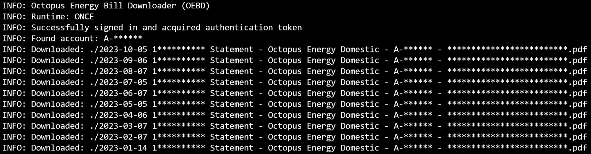
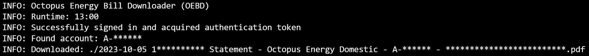
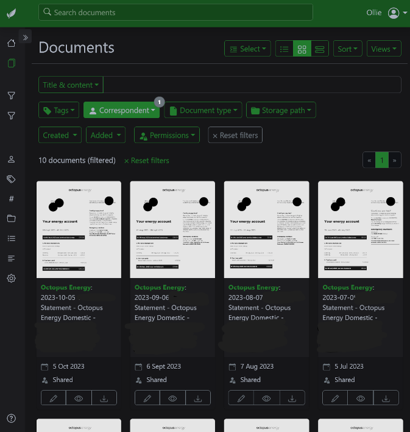

# Octopus Energy Bill Downloader (OEBD)

OEBD is a tool for getting [Octopus Energy](https://octopus.energy/) bill PDFs automatically. The original use-case for this tool was for automatic consumption into [Paperless-ngx](https://github.com/paperless-ngx/paperless-ngx); see the [docker-compose.yml](docker-compose.yml) example, which I run in Portainer in my Paperless-ngx stack.

### Run once example output


### Daemon example output


### Paperless screenshot


## Usage

### Docker
``` sh
mkdir -p ./bills

# One time download of past 12 bills
docker run \
  -e OCTOPUS_USERNAME="abc@email" \
  -e OCTOPUS_PASSWORD="123" \
  -e BILL_COUNT="12" \
  -e DOWNLOAD_TIME="ONCE" \
  -v "${pwd}/bills:/app/consume" \
  -e SAVE_LOCATION="/app/consume" \
  --name oebd_once \
  -t ghcr.io/olliejc/oebd
  # -t $(docker build -q .)

# Scheduled looping downloader
docker run \
  -e OCTOPUS_USERNAME="abc@email" \
  -e OCTOPUS_PASSWORD="123" \
  -v "${pwd}/bills:/app/consume" \
  -e SAVE_LOCATION="/app/consume" \
  --name oebd_daemon \
  --restart=unless-stopped \
  -d ghcr.io/olliejc/oebd
  # -d $(docker build -q .)
```

### Linux
``` sh
python3 -m pip install -r requirements.txt

# One time download of past 12 bills
DOWNLOAD_TIME="ONCE" BILL_COUNT=12 OCTOPUS_USERNAME="abc@email" OCTOPUS_PASSWORD="123" python3 downloader.py

# Scheduled looping downloader
OCTOPUS_USERNAME="abc@email" OCTOPUS_PASSWORD="123" python3 downloader.py
```

### Windows
``` powershell
python3 -m pip install -r requirements.txt

# One time download of past 12 bills
$env:DOWNLOAD_TIME="ONCE"
$env:BILL_COUNT=12
$env:OCTOPUS_USERNAME="abc@email"
$env:OCTOPUS_PASSWORD="123"
python3 downloader.py

# Scheduled looping downloader
$env:OCTOPUS_USERNAME="abc@email"
$env:OCTOPUS_PASSWORD="123"
python3 downloader.py
```

## Configuration

Environment variables are used to configure the downloaders. The following are available:

|Variable|Purpose|
|-|-|
|OCTOPUS_USERNAME|Your Octopus Energy account email address (used to generate GraphQL JWT)|
|OCTOPUS_PASSWORD|Your Octopus Energy account password (used to generate GraphQL JWT)|
|DOWNLOAD_TIME|Set to a time (e.g. 00:30) for the autorun or "ONCE" for one-time download, defaults to random time|
|BILL_COUNT|Set how many bills to download at a time, defaults to 1|
|SAVE_LOCATION|Set the download location, defaults to pwd / "."|

## TODO

* The current method for scheduled downloads is very yucky (while loop...) and needs work.
